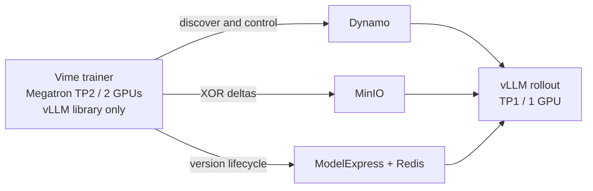

# Vime + Dynamo S3 delta refit

This example uses the mounted Hugging Face model as its local v0 seed, runs 100
Vime training steps, publishes an XOR delta after each step to MinIO through
ModelExpress, and installs them in one live Dynamo vLLM worker.



## Requirements

- A target namespace in the current `kubectl` context with a compatible
  `nvidia.com/v1beta1` Dynamo operator, three SM90+ NVIDIA GPUs, and about 70 GiB
  of node-local storage headroom for the 100 deltas.
- A `shared-model-cache` PVC containing `Qwen/Qwen3-0.6B`.
- An `nvcr-imagepullsecret` image-pull Secret and an `mx-minio-creds` Secret
  containing `MINIO_ROOT_USER` and `MINIO_ROOT_PASSWORD`.
- A sibling `dynamo` worktree checked out at commit
  `c3e05f0244ae6264d7953f68e2499c6dc2f54723`, matching the pinned Dynamo
  nightly frontend. The trainer uses the Vime revision declared in the
  Dockerfile. Its base already contains Megatron-LM; the recipe does not
  install another copy.
- `docker buildx` and `kubectl` on the client machine.

If your PVC or Secret names differ, edit the YAML directly.

MinIO intentionally uses HTTP because it is a disposable, ClusterIP-only fixture
containing public-model test data. Use HTTPS for external or persistent object
storage.

The v0 ModelExpress record is catalog-only: trainer and rollout workers seed it
from the mounted model, so no v0 object is uploaded to MinIO. Periodic full
checkpoints, when enabled, are real S3 artifacts.

## Run

From the ModelExpress repository root, build and push the two images:

```bash
docker buildx build \
  -f examples/rl/vime_dynamo_delta_refit/Dockerfile \
  --target trainer --push \
  -t registry.example.com/team/vime-dynamo-mx-trainer:delta-refit .

docker buildx build \
  -f examples/rl/vime_dynamo_delta_refit/Dockerfile \
  --build-context dynamo=../dynamo --target worker --push \
  -t registry.example.com/team/vime-dynamo-mx-worker:delta-refit .
```

Set the target namespace, images, and model path relative to the
`shared-model-cache` PVC root, then run the example:

```bash
export NAMESPACE="<namespace>"
export WORKER_IMAGE="registry.example.com/team/vime-dynamo-mx-worker:delta-refit"
export TRAINER_IMAGE="registry.example.com/team/vime-dynamo-mx-trainer:delta-refit"
export MODEL_SUBPATH="<path/to/models/Qwen3-0.6B>"

examples/rl/vime_dynamo_delta_refit/run.sh
```

The script prints the trainer log and ends with `TRAINING COMPLETE`. It intentionally
does not delete anything; discard the namespace after inspecting the run.
